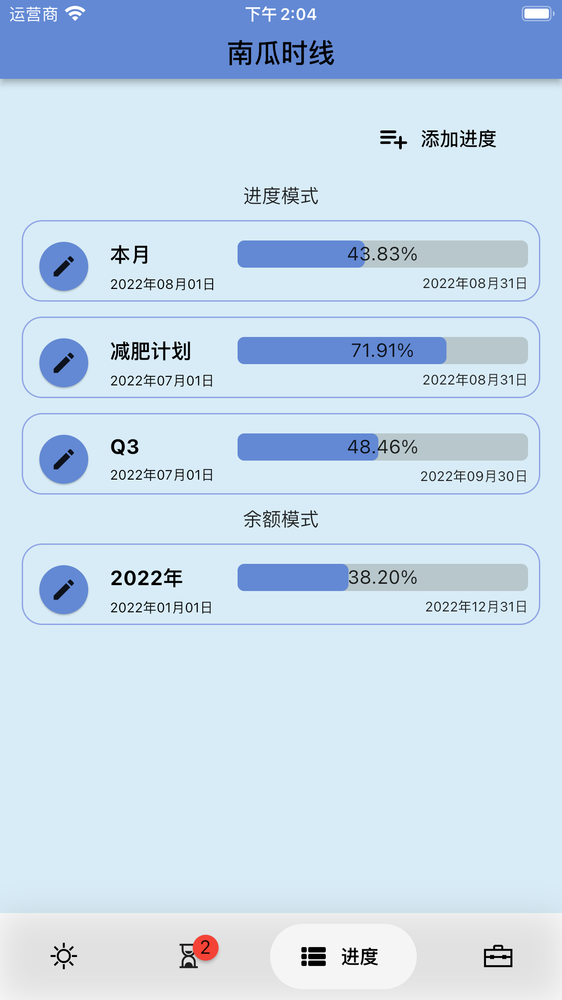

# Pkslow Timeline
Pkslow Timeline is released!!!

The app can show the balance of today, the battery and your life. You can customize the progress bar and balance bar. What's more, you can add countdowns, supporting type as Once, Anniversary, Birthday, Monthly. The main page will show the quote to you for inspiration. You can chose different themes.

Key Features:
- Show the date and time;
- Show the balance of today, the month and the year. Calculate the life balance according to the birthday and lifespan.
- Show the balance of battery;
- Show the Quotes;
- Countdown:
  - Support Once, Anniversary, Birthday and Monthly;
  - Notify on the event day;
- Processing Bar: Show the processing bar according to the start date and end date;
- Multiple themes.

Available on App Store: https://apps.apple.com/app/pkslow-timeline/id1628613820

<table>
<tr>
    <td></td>
    <td></td>
    <td></td>
</tr>
<tr>
    <td></td>
    <td></td>
    <td></td>
</tr>
</table>

Version history please check: [Releases](https://github.com/LarryDpk/pkslow-timeline/releases)

# 南瓜时线
南瓜时线发布啦！！！

南瓜时线可以显示今天、本月、今年、人生和手机电量余额，你也可以自定义。还可以添加倒数，支持的模式有单次、纪念日、生日、每月重复等。首页还会显示名人寄语。可以选择不同主题来显示。

主要功能有：
- 显示日期和时间，精确到秒；支持农历；
- 显示今天、当月、今年余额，根据生日和预计寿命显示人生余额，显示电量余额；
- 显示名人寄语；
- 倒数功能：
  - 支持单次倒数、纪念日、生日、每月循环模式；
  - 倒数提醒功能：当天事件会提醒；
  - 支持农历；
- 进度条定制：根据开始日期和结束日期，显示进度条；
- 提供多条主题样式。

可以在App Store中下载：https://apps.apple.com/app/pkslow-timeline/id1628613820

<table>
<tr>
    <td></td>
    <td></td>
    <td></td>
</tr>
<tr>
    <td></td>
    <td></td>
    <td></td>
</tr>
</table>

版本记录请查看： [Releases](https://github.com/LarryDpk/pkslow-timeline/releases)
