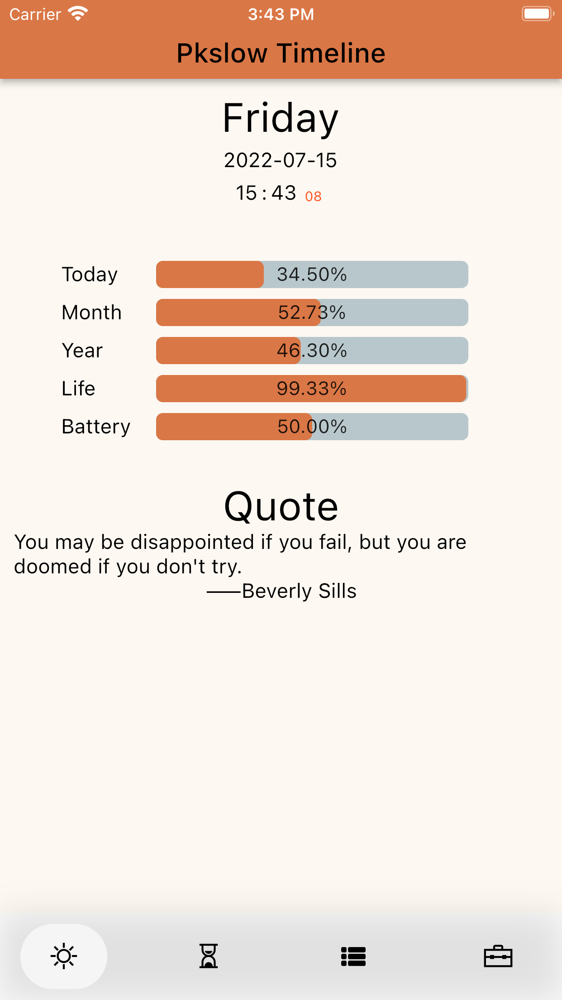
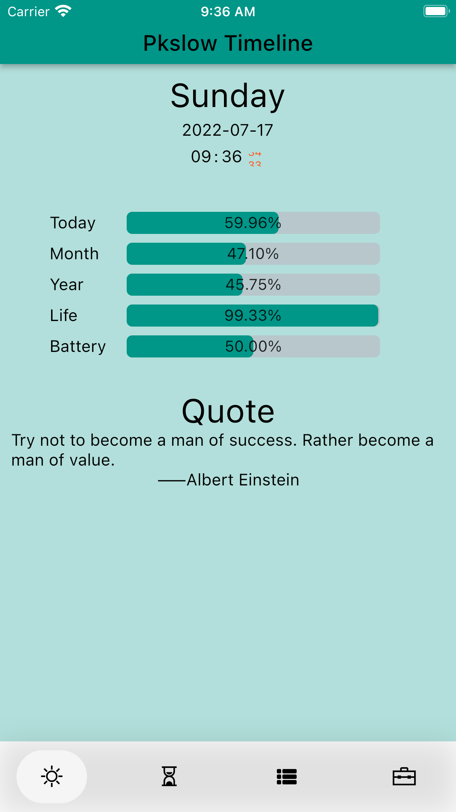
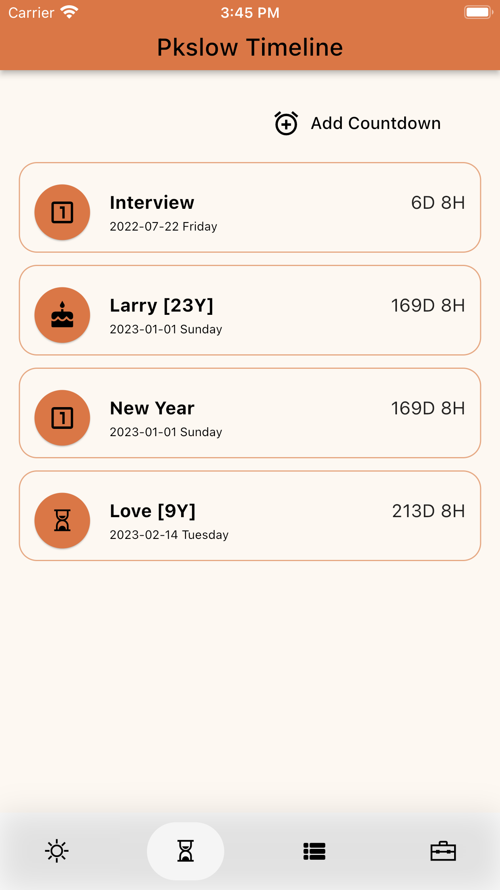
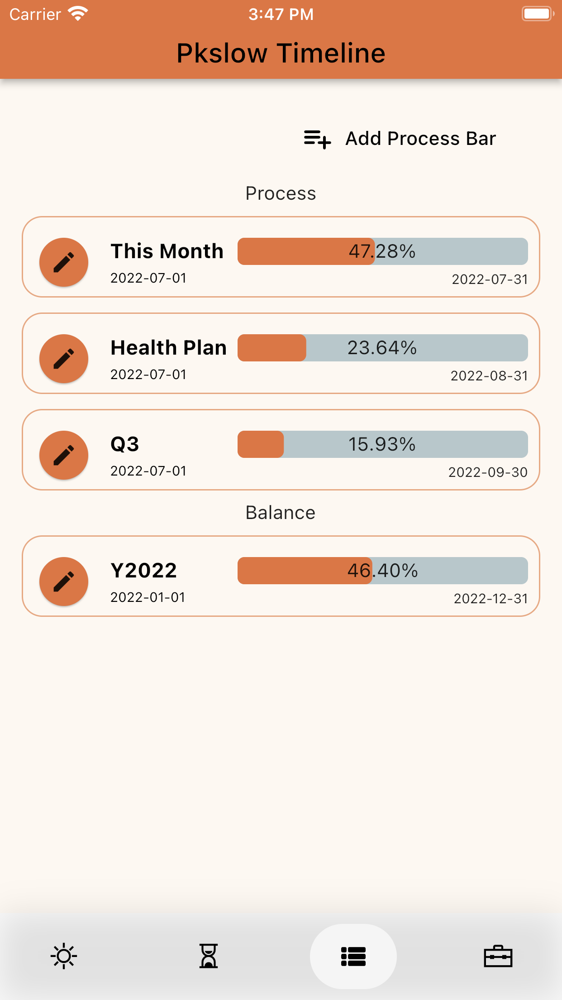
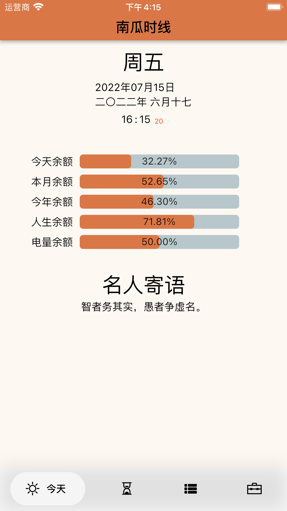
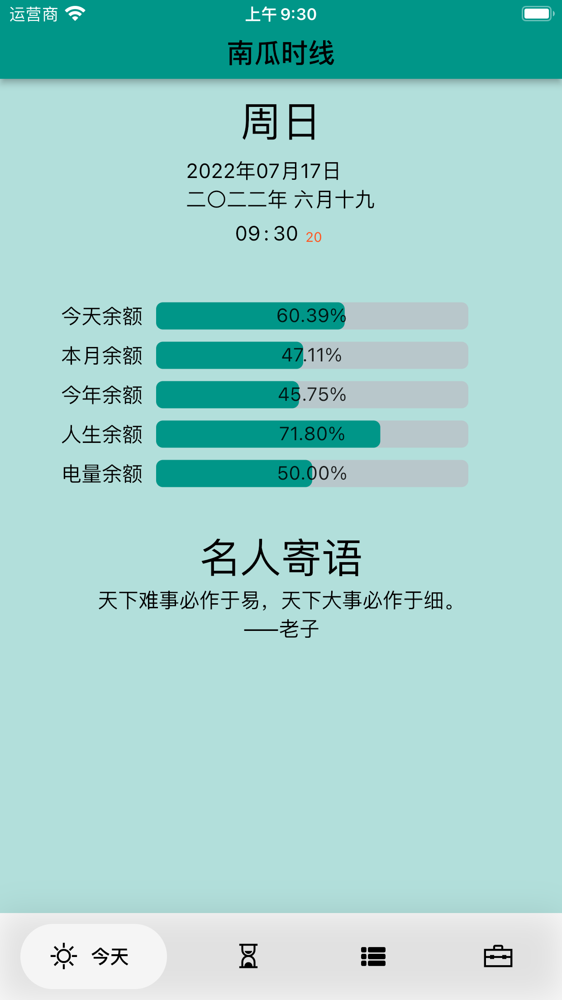
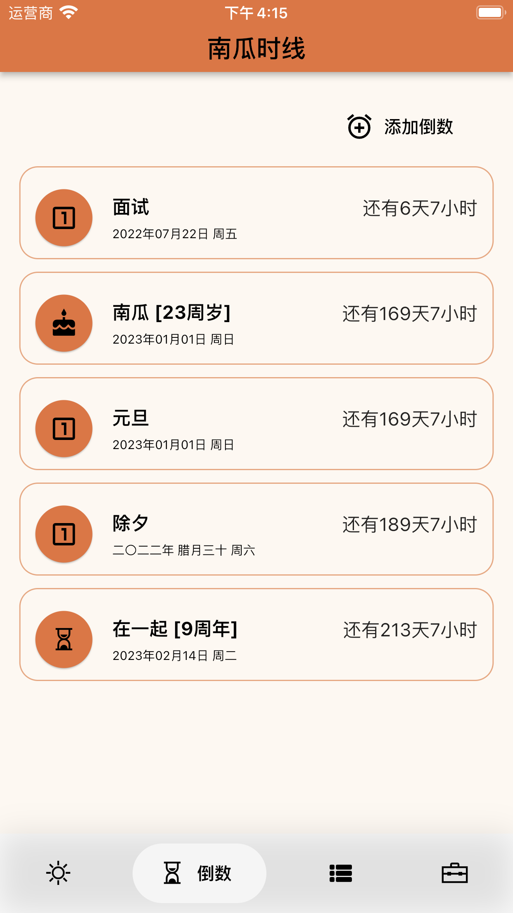
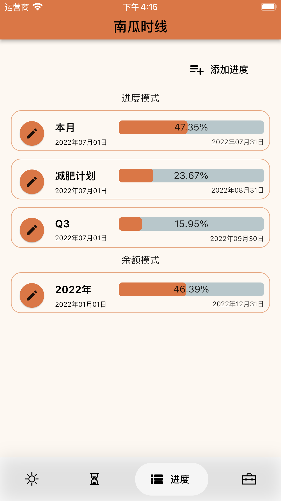

# Pkslow Timeline
Pkslow Timeline is released!!!

The app can show the balance of today, the battery and your life. You can customize the progress bar and balance bar. What's more, you can add countdowns, supporting type as Once, Anniversary, Birthday, Monthly. The main page will show the quote to you for inspiration. You can chose different themes.

Available on App Store: https://apps.apple.com/app/pkslow-timeline/id1628613820

<table>
<tr>
    <td></td>
    <td></td>
</tr>
<tr>
    <td></td>
    <td></td>
</tr>
</table>

# 南瓜时线
南瓜时线发布啦！！！

南瓜时线可以显示今天、本月、今年、人生和手机电量余额，你也可以自定义。还可以添加倒数，支持的模式有单次、纪念日、生日、每月重复等。首页还会显示名人寄语。可以选择不同主题来显示。

可以在App Store中下载：https://apps.apple.com/app/pkslow-timeline/id1628613820

<table>
<tr>
    <td></td>
    <td></td>
</tr>
<tr>
    <td></td>
    <td></td>
</tr>
</table>

